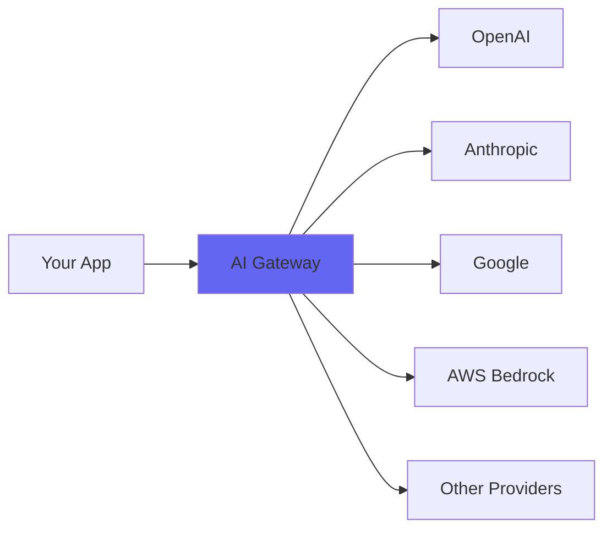

Helicone's AI Gateway provides a unified interface to access 100+ AI models from multiple providers using the OpenAI API format. Get intelligent routing, automatic fallbacks, cost optimization, and full observability out of the box.

## Key Features

<CardGroup cols={2}>
  <Card title="Universal Access" icon="globe">
    Access models from OpenAI, Anthropic, Google, AWS Bedrock, and 20+ other providers through one API
  </Card>
  <Card title="Intelligent Routing" icon="route">
    Automatically route requests to the best available provider based on availability and performance
  </Card>
  <Card title="Automatic Fallbacks" icon="shield-halved">
    Built-in redundancy with automatic failover when providers are down or rate limited
  </Card>
  <Card title="Cost Optimization" icon="piggy-bank">
    Request caching, smart routing, and usage controls to minimize your AI spend
  </Card>
</CardGroup>

## How It Works

The AI Gateway sits between your application and AI providers, handling:

1. **Request Processing** - Validates and transforms requests to match provider formats
2. **Provider Selection** - Routes to optimal providers based on your configuration
3. **Authentication** - Manages API keys for both BYOK (Bring Your Own Key) and PTB (Pay Through Billing)
4. **Error Handling** - Automatically retries and falls back on failures
5. **Observability** - Logs all requests for monitoring and debugging



## Quick Start

<Steps>
  <Step title="Get Your API Key">
    Sign up at [helicone.ai](https://helicone.ai/signup) and get your API key from the dashboard.
  </Step>
  
  <Step title="Update Your Code">
    Change the `baseURL` to Helicone's AI Gateway:
    
    ```typescript
    import OpenAI from "openai";

    const client = new OpenAI({
      baseURL: "https://ai-gateway.helicone.ai",
      apiKey: process.env.HELICONE_API_KEY,
    });
    ```
  </Step>
  
  <Step title="Make Requests">
    Use the OpenAI SDK as normal - the gateway handles the rest:
    
    ```typescript
    const response = await client.chat.completions.create({
      model: "gpt-4o-mini",  // or any model from helicone.ai/models
      messages: [{ role: "user", content: "Hello!" }]
    });
    ```
  </Step>
</Steps>

## Supported Models

The gateway supports 100+ models across providers:

- **OpenAI**: GPT-4o, GPT-4o-mini, o1, o3-mini, and more
- **Anthropic**: Claude 4.5 Sonnet, Claude 4.5 Haiku, Claude Opus
- **Google**: Gemini 2.0 Flash, Gemini 1.5 Pro, Gemini 2.0 Flash Thinking
- **AWS Bedrock**: Various models through AWS
- **Open Source**: Llama, Mistral, Qwen, DeepSeek, and more

View the complete list at [helicone.ai/models](https://helicone.ai/models).

## Architecture

### Request Flow

```typescript
// worker/src/routers/aiGatewayRouter.ts
// The gateway processes requests through these stages:

1. Authentication - Validates Helicone API key
2. Token Limit Check - Applies fallback if token limits exceeded  
3. Request Parsing - Validates body and extracts model list
4. Attempt Building - Creates routing attempts for each provider
5. Provider Execution - Tries each attempt until success
6. Response Mapping - Converts provider responses to OpenAI format
```

### BYOK vs PTB

The gateway supports two authentication modes:

<Tabs>
  <Tab title="BYOK (Bring Your Own Key)">
    Use your own provider API keys:
    
    - Full control over your provider accounts
    - Direct billing from providers
    - Configure keys in Helicone dashboard
    - Higher priority in routing
    
    ```typescript
    // Keys configured at: helicone.ai/settings/keys
    // Gateway automatically uses your keys when available
    ```
  </Tab>
  
  <Tab title="PTB (Pay Through Billing)">
    Use Helicone's provider keys:
    
    - No need to manage provider accounts
    - Unified billing through Helicone
    - Automatic credit management
    - Fallback when BYOK unavailable
    
    ```typescript
    // Add credits at: helicone.ai/credits
    // Gateway uses PTB when no BYOK keys configured
    ```
  </Tab>
</Tabs>

## Response Format

All responses are normalized to OpenAI's format, regardless of the underlying provider:

```json
{
  "id": "chatcmpl-123",
  "object": "chat.completion",
  "created": 1677652288,
  "model": "claude-sonnet-4",
  "choices": [{
    "index": 0,
    "message": {
      "role": "assistant",
      "content": "Hello! How can I help you today?"
    },
    "finish_reason": "stop"
  }],
  "usage": {
    "prompt_tokens": 9,
    "completion_tokens": 12,
    "total_tokens": 21
  }
}
```

## Advanced Features

<CardGroup cols={2}>
  <Card title="Multi-Model Routing" icon="diagram-project" href="/gateway/routing">
    Request multiple models with automatic provider selection
  </Card>
  <Card title="Automatic Fallbacks" icon="arrows-turn-to-dots" href="/gateway/fallbacks">
    Configure fallback chains for high availability
  </Card>
  <Card title="Request Caching" icon="database" href="/gateway/caching">
    Cache responses to reduce costs and latency
  </Card>
  <Card title="Rate Limiting" icon="gauge-high" href="/gateway/rate-limiting">
    Control request rates by user, property, or globally
  </Card>
</CardGroup>

## Observability

Every request through the gateway is automatically logged:

- Request/response bodies
- Latency and token usage
- Provider and model used
- Success/failure status
- Cost calculations

View logs in the [Helicone dashboard](https://helicone.ai/dashboard) with filtering, search, and analytics.

## API Compatibility

The gateway is compatible with:

- OpenAI SDK (Python, TypeScript/JavaScript, Go, etc.)
- LangChain and LangGraph
- LlamaIndex
- Vercel AI SDK
- Any tool that uses OpenAI's API format

## Next Steps

<CardGroup cols={2}>
  <Card title="Quick Setup" icon="rocket" href="/gateway/quickstart">
    Get started in 2 minutes with our quickstart guide
  </Card>
  <Card title="Model List" icon="list" href="https://helicone.ai/models">
    Browse all available models and providers
  </Card>
  <Card title="Configuration" icon="sliders" href="/gateway/routing">
    Learn about routing and provider selection
  </Card>
  <Card title="Examples" icon="code" href="/examples">
    See example integrations and use cases
  </Card>
</CardGroup>
