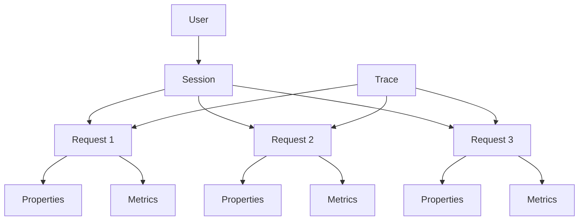

import QuestionsSection from "/snippets/questions-section.mdx";

## What is Observability in Helicone?

Helicone provides comprehensive observability for your LLM applications, giving you deep insights into every aspect of your AI infrastructure. From individual request traces to aggregated user metrics, Helicone helps you understand, debug, and optimize your AI applications.

## Core Observability Features

<CardGroup cols={2}>
<Card title="Requests" icon="message" href="/observability/requests">
View and analyze individual LLM requests with detailed request/response data, timing metrics, and token usage
</Card>

<Card title="Sessions" icon="diagram-project" href="/observability/sessions">
Track multi-turn conversations and complex AI agent workflows with hierarchical session visualization
</Card>

<Card title="Traces" icon="route" href="/observability/traces">
Distributed tracing for complex workflows, tracking requests across LLMs, vector databases, and tools
</Card>

<Card title="Custom Properties" icon="tags" href="/observability/custom-properties">
Add custom metadata to requests for powerful filtering, segmentation, and analysis
</Card>

<Card title="User Metrics" icon="users" href="/observability/user-metrics">
Track per-user behavior, costs, and usage patterns to understand your user base
</Card>

<Card title="Cost Tracking" icon="dollar-sign" href="/observability/cost-tracking">
Monitor and analyze costs across models, users, and time with precise cost breakdowns
</Card>
</CardGroup>

## Why Observability Matters

<AccordionGroup>
<Accordion title="Debug Issues Faster">
Quickly identify and resolve issues by viewing complete request traces, error messages, and timing data. See exactly what went wrong and when.
</Accordion>

<Accordion title="Optimize Performance">
Track latency, time-to-first-token, and throughput metrics to identify bottlenecks and optimize your application's responsiveness.
</Accordion>

<Accordion title="Control Costs">
Monitor spending in real-time across models, users, and features. Identify cost drivers and optimize your LLM usage.
</Accordion>

<Accordion title="Understand User Behavior">
See how users interact with your AI features. Track engagement patterns, popular workflows, and user-specific metrics.
</Accordion>

<Accordion title="Ensure Quality">
Monitor output quality, track success rates, and identify edge cases that need attention.
</Accordion>
</AccordionGroup>

## Getting Started

<Steps>
<Step title="Set up your integration">
Integrate Helicone using our proxy, SDK, or async logging. Choose the method that works best for your stack.

```typescript
import { OpenAI } from "openai";

const client = new OpenAI({
  apiKey: process.env.OPENAI_API_KEY,
  baseURL: "https://oai.helicone.ai/v1",
  defaultHeaders: {
    "Helicone-Auth": `Bearer ${process.env.HELICONE_API_KEY}`,
  },
});
```
</Step>

<Step title="Start making requests">
Your requests are automatically logged and available in the Helicone dashboard.

```typescript
const response = await client.chat.completions.create({
  model: "gpt-4o-mini",
  messages: [{ role: "user", content: "Hello!" }],
});
```
</Step>

<Step title="Add custom metadata">
Enrich your data with custom properties for better filtering and analysis.

```typescript
const response = await client.chat.completions.create(
  {
    model: "gpt-4o-mini",
    messages: [{ role: "user", content: "Hello!" }],
  },
  {
    headers: {
      "Helicone-Property-Environment": "production",
      "Helicone-Property-User-Id": "user_123",
      "Helicone-Property-Feature": "chat",
    },
  }
);
```
</Step>

<Step title="Explore your data">
View requests, sessions, and metrics in the Helicone dashboard. Filter by custom properties, time ranges, and more.
</Step>
</Steps>

## Key Concepts

### Requests
Individual LLM API calls with complete request/response data, timing metrics, token usage, and costs. Every interaction with an LLM provider is captured as a request.

### Sessions
Groups of related requests that represent a complete workflow or conversation. Sessions help you understand multi-step interactions and AI agent behavior.

### Traces
Distributed traces that span multiple services and tools. Track requests across LLMs, vector databases, function calls, and custom tools.

### Properties
Custom key-value metadata attached to requests. Use properties to segment data by user, environment, feature, or any other dimension.

### Metrics
Aggregated statistics computed from your request data, including costs, latency, token usage, and custom metrics.

## Observability Data Model



## Common Use Cases

<Tabs>
<Tab title="Debugging">
**Problem**: Your AI agent is producing incorrect outputs for certain users.

**Solution**: 
1. Filter requests by user ID using custom properties
2. View the complete session to see all steps in the workflow
3. Examine individual request/response pairs to identify the failure point
4. Check timing metrics to see if timeouts are causing issues
</Tab>

<Tab title="Cost Optimization">
**Problem**: Your LLM costs are higher than expected.

**Solution**:
1. Use cost tracking to identify which models are most expensive
2. Filter by custom properties to see which features drive costs
3. Analyze per-user costs to identify high-usage customers
4. Compare costs across time periods to track optimization efforts
</Tab>

<Tab title="Performance Monitoring">
**Problem**: Users report that your AI features feel slow.

**Solution**:
1. Track latency and time-to-first-token metrics
2. Filter by environment (production vs staging) to compare
3. View session traces to identify bottlenecks in multi-step workflows
4. Set up alerts for latency thresholds
</Tab>

<Tab title="User Analytics">
**Problem**: You want to understand how different user segments use your AI features.

**Solution**:
1. Add user properties (tier, plan, cohort) to all requests
2. Use user metrics to track engagement and usage patterns
3. Segment costs by user properties
4. Identify power users and their common workflows
</Tab>
</Tabs>

## Best Practices

<AccordionGroup>
<Accordion title="Use Custom Properties Strategically">
Add properties that help you answer business questions:
- **Environment**: production, staging, development
- **User metadata**: user_id, tier, plan_type
- **Feature tracking**: feature_name, workflow_type
- **Business context**: customer_id, organization_id

Avoid adding properties that change on every request (like timestamps or random IDs).
</Accordion>

<Accordion title="Structure Sessions Properly">
Use consistent session IDs and paths:
- Generate unique session IDs for each conversation/workflow
- Use hierarchical paths to represent relationships: `/parent/child/grandchild`
- Keep session names consistent for the same type of workflow
- Group related requests together in the same session
</Accordion>

<Accordion title="Monitor What Matters">
Focus on metrics that impact your business:
- **User experience**: latency, error rates, quality scores
- **Cost management**: total costs, cost per user, cost per feature
- **Reliability**: success rates, timeout rates, retry counts
- **Usage patterns**: requests per user, popular features, peak times
</Accordion>

<Accordion title="Set Up Alerts">
Create alerts for critical thresholds:
- High error rates indicating service issues
- Unusual cost spikes suggesting misuse or bugs
- Latency degradation affecting user experience
- Rate limit warnings to prevent service disruption
</Accordion>
</AccordionGroup>

## Next Steps

<CardGroup cols={2}>
<Card title="View Requests" icon="eye" href="/observability/requests">
Learn how to view and analyze individual requests
</Card>

<Card title="Track Sessions" icon="diagram-project" href="/observability/sessions">
Set up session tracking for multi-turn conversations
</Card>

<Card title="Add Custom Properties" icon="tag" href="/observability/custom-properties">
Enrich your data with custom metadata
</Card>

<Card title="Monitor Costs" icon="chart-line" href="/observability/cost-tracking">
Set up cost tracking and analysis
</Card>
</CardGroup>

<QuestionsSection />
